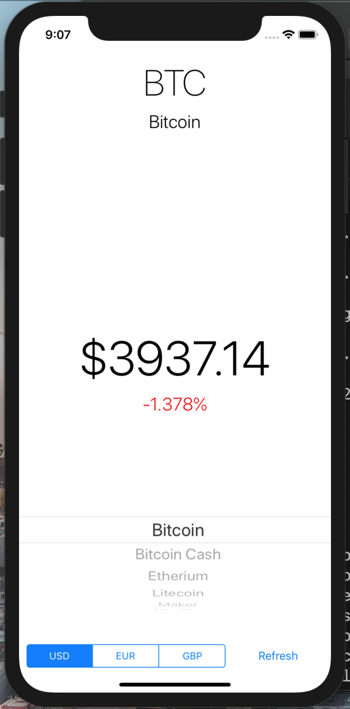
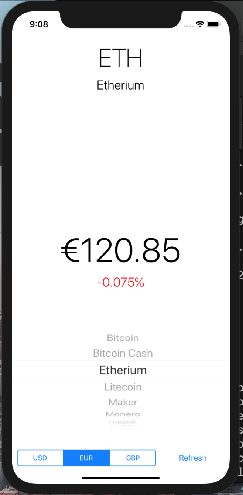
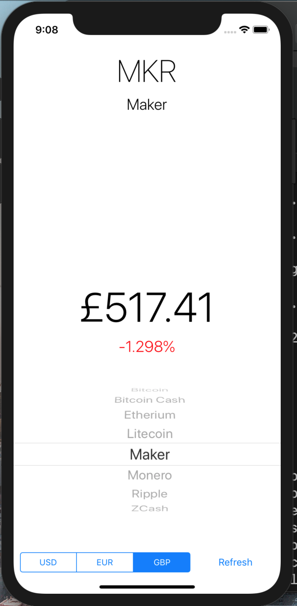

# CryptoTicker #

CryptoTicker is a simple iOS app that uses the Cryptonator RESTful API to retrieve the latest cryptocurrency data in a user-centered fashion.

## Motivation ##

The motive behind this project was to build a simple and useful cryptocurrency exchange tool while building skills in Representational State Transfer API's which uses HTTP requests to GET, PUT, POST and DELETE data. Responses are returned in a JSON format. 

## Screenshots ##

## Technology and frameworks used ##

**Built with**
  * Swift 4.0
  * XCode 10.1
  * CocoaPods
  * [Cryptonator API](https://www.cryptonator.com/api/ "Cryptonator")
  
## Installation ## 

1. Pull files from the repo.
2. Open CryptoTracker.xcodeproj on XCode.
3. Select which simulator you'd like to run the application on in the top left corner of XCode. 
4. Build and run simulator.

## How To Use ## 

1. Select which cryptocurrency you'd like to retrieve information on in the scroll bar. 
2. Select which currency you'd like the cryptocurrency to be displayed in through the tab bar in the bottom. 
3. Tap "Refresh."
4. Repeat until satisfied. 

## Credits ## 

Initial project idea and spec credits go to Berkeley's iOS Decal 2019. 
Full implementation carried out by Micah Yong. 
